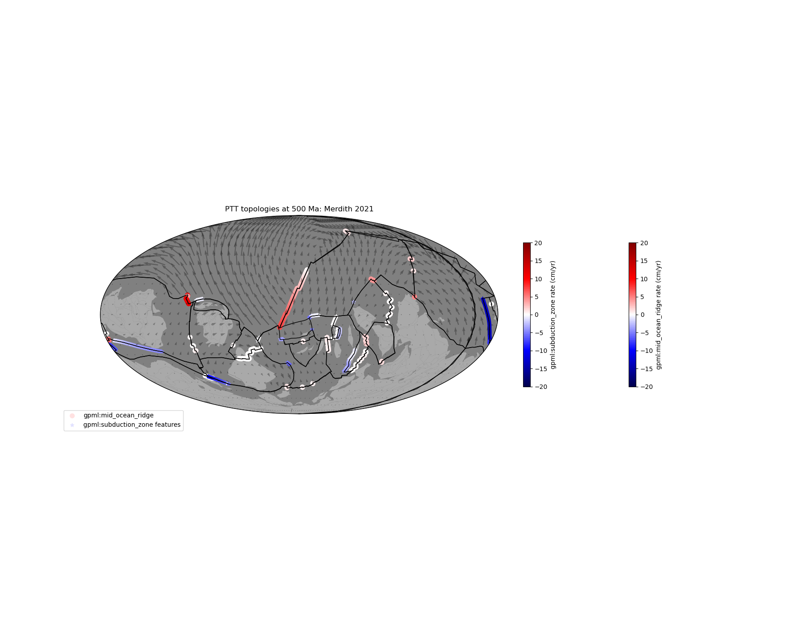
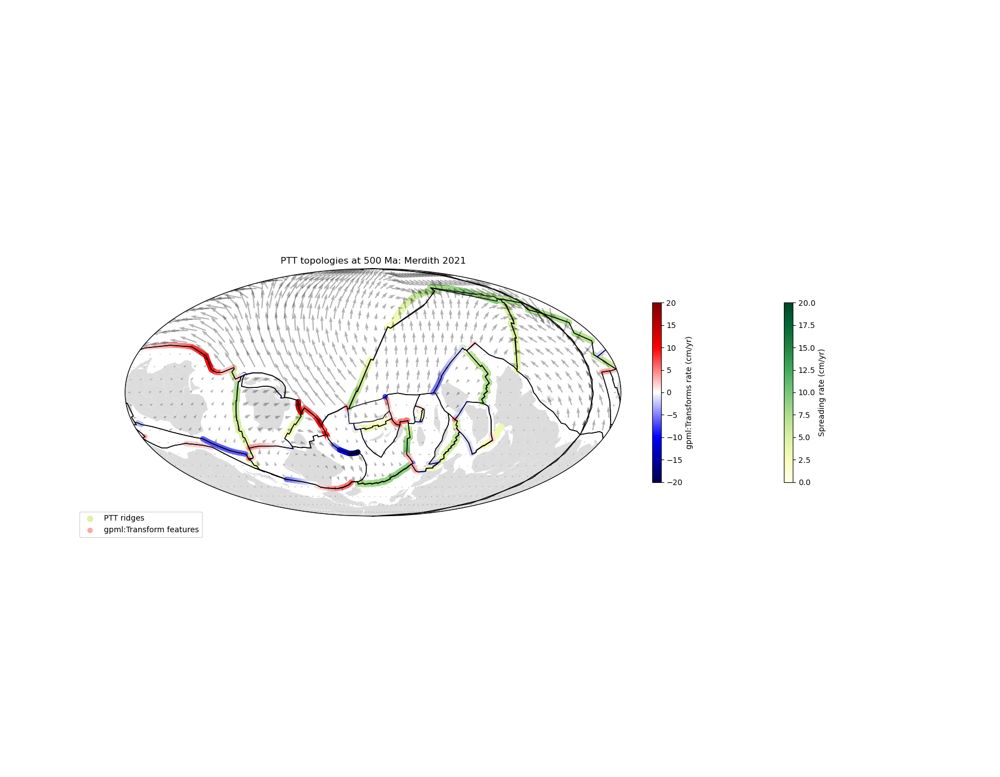

# plate-model-debug

Workflows to debug plate models.

### Dependencies

- [pyGPlates](https://www.gplates.org/docs/pygplates/pygplates_getting_started.html#installation)
- [PlateTectonicTools](https://github.com/EarthByte/PlateTectonicTools)
- [GPlately](https://github.com/GPlates/gplately)
- NumPy
- SciPy
- Matplotlib
- [Cartopy](https://scitools.org.uk/cartopy/docs/latest/index.html#getting-started) (for mapping)
- Shapely
- [Pooch](https://github.com/fatiando/pooch)
- GeoPandas
- netCDF4

### Negative divergence in ridges and negative convergence in trenches
This analysis can be done on Notebook [__01-Diagnosing-Negative-Divergence-and-Convergence__](./Topology-Divergence-Convergence/01-Diagnosing-Negative-Divergence-and-Convergence.ipynb). A sample output is shown below:

### Divergence and convergence in GPML transform features
This analysis can be done on Notebook [__02-Diagnose-Convergence-and-Divergence-in-GPML-Transforms__](./Topology-Divergence-Convergence/02-Diagnose-Convergence-and-Divergence-in-GPML-Transforms.ipynb). A sample output is shown below:

